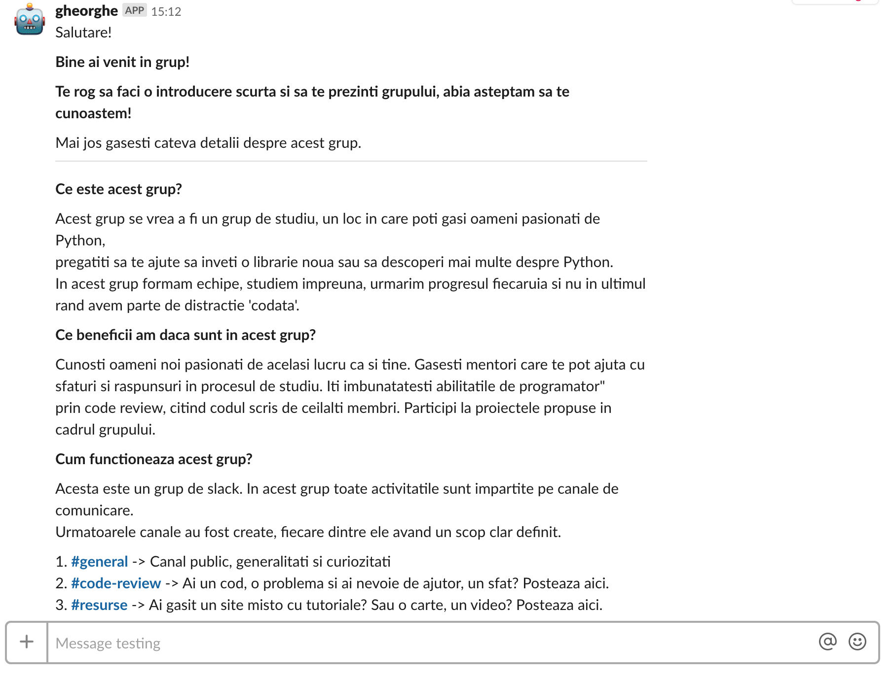

 

  

# Pyton Romania Study Group

Welcome to the Python Study Group community!
We are a growing and inclusive community of Python enthusiasts ranging from those
just starting to those who have built their entire career around it.
Our community has a range of resources from our main presence on Slack to our community
projects

## Gheorghe 2.0

This is a slack bot developed for Python Study Group community. Gheorghe2.0 is 
an enhanced version of another [Gheorghe](https://github.com/python-romania/gheorghe).
Gheorghe2.0 is build usig flask and Slack Events API, where the previous verison was created 
using Slack RMT API.

## Rock-Paper-Scissors 

Wanna play? Gheorghe is ready to play with you Rock-Paper-Scissors. This is a small game implemented using 
slack commands.

